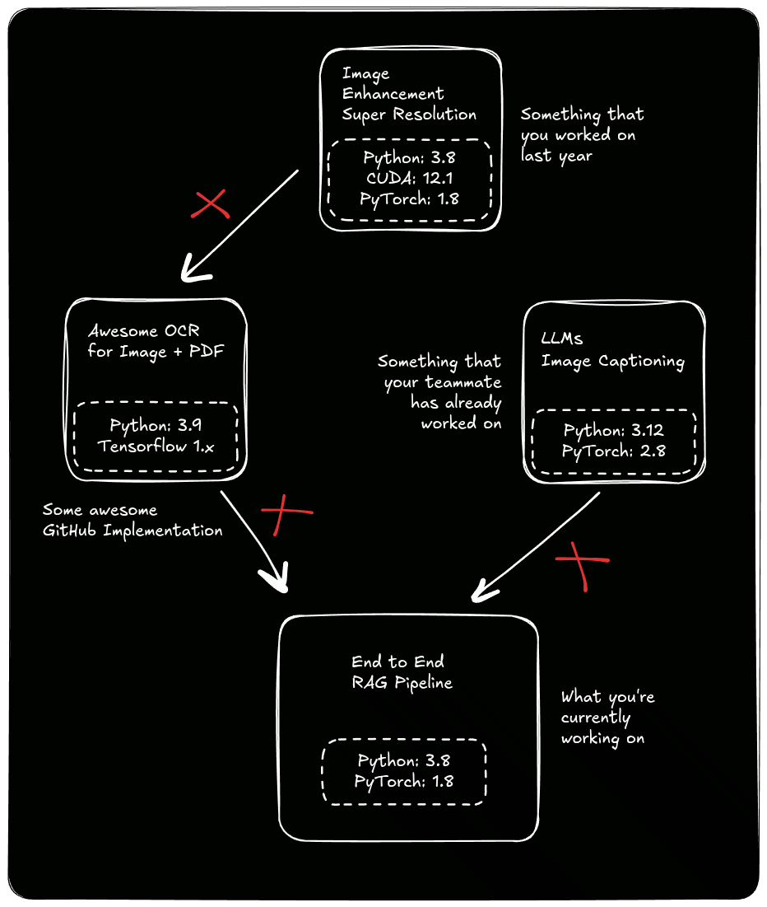
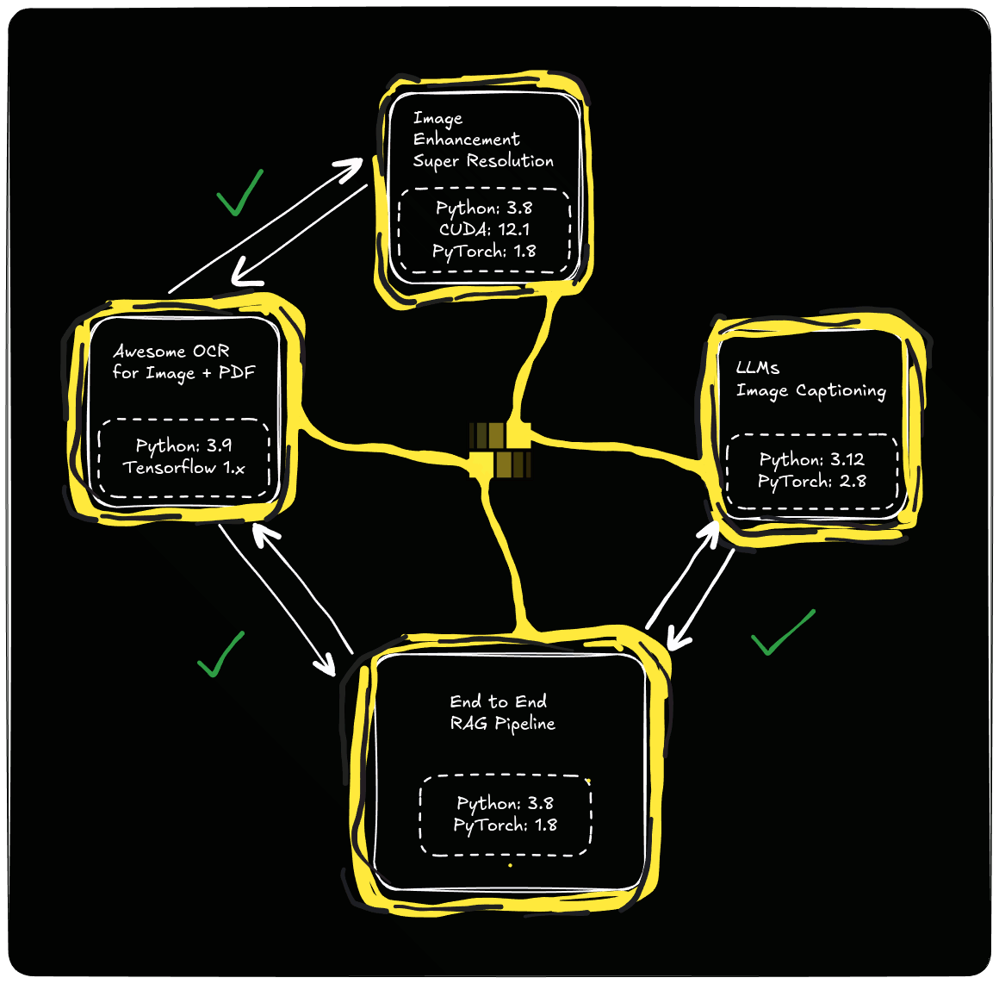

---
hide:
  - toc
---

True plug-and-play interoperability for orchestrating AI workflows.

OpenCrate is an [open-source](https://github.com/OpenCrateAI/opencrate) framework that lets you easily develop your AI workflows and its modules into isolated, self-contained runtimes and expose them as native, composable building blocks. This enables you, your team, and the open-source community to seamlessly integrate complex, incompatible modules.

You can 'import' a module running on a completely different Python version or dependency stack as if it were a standard library function. This defines true plug-and-play interoperability.

OpenCrate is built with portability at its foundation, designed to make interoperability a solved problem. It abstracts away runtime complexity, allowing you to focus on what actually matters: Loss functions, architectures, metrics, and intelligence.

## **__Storytime__**
Picture this: You stumble upon the *perfect* research paper or a brilliant GitHub project. It solves exactly the problem you've been banging your head against for a week. You clone the repo, crack your knuckles, and get ready to integrate this new finding directly into your existing workflow.

And here's how the story usually ends:

- The new module demands **TensorFlow 1.x** and **Python 3.8**.
- Your current stack is happily running **PyTorch 2.2** on **Python 3.12**.
- The CUDA driver dependencies start fighting with your GPU.
- And the pip installs? It turns into a battle royale where nobody wins.

You either rage quit (because who rewrites their entire stack "in the hope" that something magical is gonna happen?), or if you're brave enough, you try to force it to work. Instead of making progress, you spend hours—if not days—fixing import errors and **rewriting perfectly good code just to make it fit**. Ugh.

## **__Current State of AI Development__**

Let's be real: AI development right now is kind of a mess.

- ✗ **The Compatibility Wall**: Great tools are locked away in incompatible ecosystems. You can't easily mix a legacy OCR model with a modern LLM without complex microservices or hacky workarounds.
- ✗ **Artifact Scavenger Hunts**: Logs, outputs, and checkpoints are scattered everywhere. "Reproducibility" is basically just a nice idea we talk about but rarely actually see. As the project grows, so does the chaos.
- ✗ **Code Rot**: That project you built a year ago? It's basically a fossil. Trying to integrate it today means rewriting half of it just to make it run.
- ✗ **Less science, more legwork**: Often instead of focusing on model innovation, you're stuck wrestling with dependencies, conflicts, setups, and environment issues.

## **__What does OpenCrate do?__**

Yaha pe abhi aur likhna baaki hai...

 
 
 