```mermaid
%%{init: {
  'theme': 'base',
  'themeVariables': {
    'primaryColor': '#020617',
    'primaryTextColor': '#e2e8f0',
    'primaryBorderColor': '#475569',
    'lineColor': '#94a3b8',
    'secondaryColor': '#0f172a',
    'tertiaryColor': '#000000',
    'fontSize': '14px',
    'nodeSpacing': 80,
    'rankSpacing': 100
  },
  'flowchart': {
    'curve': 'basis',
    'padding': 20,
    'nodeSpacing': 60,
    'rankSpacing': 80,
    'htmlLabels': true,
    'useMaxWidth': false
  }
}}%%

flowchart LR
    %% --- STYLES ---
    classDef ext fill:#000,stroke:#f59e0b,stroke-width:2px,color:#f59e0b;
    classDef pyProcess fill:#1e3a8a,stroke:#60a5fa,stroke-width:2px,color:#dbeafe;
    classDef cppProcess fill:#064e3b,stroke:#34d399,stroke-width:2px,color:#d1fae5;
    classDef memory fill:#450a0a,stroke:#f43f5e,stroke-width:2px,color:#ffe4e6,stroke-dasharray: 5 5;
    classDef gcs fill:#4a1d96,stroke:#a78bfa,stroke-width:2px,color:#e9d5ff;

    %% =============================================
    %% EXTERNAL CLIENTS
    %% =============================================
    subgraph External ["&nbsp;&nbsp;&nbsp;🌍 EXTERNAL CLIENTS&nbsp;&nbsp;&nbsp;"]
        direction TB
        style External fill:#0f172a,stroke:#333,stroke-width:2px

        Client(["&nbsp;&nbsp;&nbsp;&nbsp;👤 User / Client&nbsp;&nbsp;&nbsp;&nbsp;<br/><br/>Sends HTTP requests<br/>to prediction endpoint&nbsp;&nbsp;"]):::ext

        LB{"&nbsp;&nbsp;&nbsp;&nbsp;🔀 Load Balancer&nbsp;&nbsp;&nbsp;&nbsp;<br/><br/>AWS ALB / Nginx<br/><br/>Distributes traffic<br/>across Proxy nodes&nbsp;&nbsp;"}:::ext
    end

    %% =============================================
    %% RAY CLUSTER
    %% =============================================
    subgraph Cluster ["&nbsp;&nbsp;&nbsp;☁️ RAY CLUSTER&nbsp;&nbsp;&nbsp;"]
        direction TB
        style Cluster fill:#020617,stroke:#475569,stroke-width:2px

        %% --- HEAD NODE ---
        subgraph Head ["&nbsp;&nbsp;&nbsp;🖥️ HEAD NODE&nbsp;&nbsp;&nbsp;"]
            direction TB
            style Head fill:#0f172a,stroke:#64748b,stroke-width:1px

            GCS[("&nbsp;&nbsp;🗄️ GCS&nbsp;&nbsp;<br/><br/>Global Control Service<br/><br/>• Centralized metadata<br/>• Actor directory<br/>• Node membership<br/>• Checkpoints to Redis&nbsp;&nbsp;")]:::gcs

            Controller[("&nbsp;&nbsp;🎛️ Serve Controller&nbsp;&nbsp;<br/><br/>Python Actor<br/><br/>FROM: serve.run API<br/><br/>• Creates Proxies/Replicas<br/>• Manages routing table<br/>• Runs autoscaler<br/>• Health-checks replicas&nbsp;&nbsp;")]:::pyProcess

            HeadRaylet["&nbsp;&nbsp;⚙️ Head Raylet&nbsp;&nbsp;<br/><br/>C++ Daemon<br/><br/>Local scheduling<br/>& object management&nbsp;&nbsp;"]:::cppProcess
        end

        %% --- WORKER NODE ---
        subgraph Worker ["&nbsp;&nbsp;&nbsp;🖥️ WORKER NODE (can be multiple)&nbsp;&nbsp;&nbsp;"]
            direction TB
            style Worker fill:#0f172a,stroke:#64748b,stroke-width:1px

            %% SYSTEM LAYER
            subgraph Sys ["&nbsp;&nbsp;⚙️ SYSTEM LAYER&nbsp;&nbsp;"]
                direction TB
                style Sys fill:#27272a,stroke:#404040,stroke-width:1px

                Raylet["&nbsp;&nbsp;⚙️ Raylet&nbsp;&nbsp;<br/><br/>C++ Daemon<br/><br/>FROM: GCS, Raylets<br/><br/>• Schedules local tasks<br/>• Object transfers<br/>• Reports resources&nbsp;&nbsp;"]:::cppProcess
            end

            %% OBJECT STORE
            subgraph RAM ["&nbsp;&nbsp;🧠 OBJECT STORE /dev/shm&nbsp;&nbsp;"]
                direction TB
                style RAM fill:#27272a,stroke:#404040,stroke-width:1px

                Plasma[("&nbsp;&nbsp;💾 Plasma Store&nbsp;&nbsp;<br/><br/>Shared Memory<br/><br/>FROM: ray.put, returns<br/><br/>• Objects over 100KB<br/>• Zero-copy mmap<br/>• Immutable data<br/>• Node-local&nbsp;&nbsp;")]:::memory
            end

            %% USER SPACE
            subgraph UserSpace ["&nbsp;&nbsp;🐍 USER SPACE - Python Workers&nbsp;&nbsp;"]
                direction TB
                style UserSpace fill:#27272a,stroke:#404040,stroke-width:1px

                Proxy["&nbsp;&nbsp;📡 HTTP Proxy Actor&nbsp;&nbsp;<br/><br/>Uvicorn Server<br/><br/>FROM: Load Balancer<br/><br/>• Accepts HTTP/gRPC<br/>• Looks up routes<br/>• Queues requests<br/>• Forwards to replica&nbsp;&nbsp;"]:::pyProcess

                Replica["&nbsp;&nbsp;🤖 Replica Actor&nbsp;&nbsp;<br/><br/>Your Model<br/><br/>FROM: Proxy Handle<br/><br/>• Runs __call__ method<br/>• Batched requests<br/>• Returns predictions&nbsp;&nbsp;"]:::pyProcess
            end
        end
    end

    %% =============================================
    %% CONNECTIONS - REQUEST FLOW
    %% =============================================

    %% Step 1: Client to Load Balancer
    Client -->|"&nbsp;① HTTP POST /predict&nbsp;<br/>&nbsp;Body: JSON/binary&nbsp;"| LB

    %% Step 2: Load Balancer to Proxy
    LB -->|"&nbsp;② Forward Request&nbsp;<br/>&nbsp;Raw HTTP bytes&nbsp;"| Proxy

    %% Step 3: Store large payload
    Proxy -->|"&nbsp;③ Store if >100KB&nbsp;<br/>&nbsp;ray.put → ObjectRef&nbsp;"| Plasma

    %% Step 4: Get routing table
    Proxy -.->|"&nbsp;④ Get Routes&nbsp;<br/>&nbsp;Async poll&nbsp;"| Controller

    %% Step 5: Controller to GCS
    Controller -.->|"&nbsp;Register actors&nbsp;<br/>&nbsp;Checkpoint state&nbsp;"| GCS

    %% Step 6: Dispatch to Replica
    Proxy -->|"&nbsp;⑤ Dispatch&nbsp;<br/>&nbsp;DeploymentHandle&nbsp;<br/>&nbsp;ObjectRef + meta&nbsp;"| Replica

    %% Step 7: GCS to Raylet
    GCS -.->|"&nbsp;Node info&nbsp;<br/>&nbsp;Resources&nbsp;"| Raylet

    %% Step 8: Read from Object Store
    Replica -->|"&nbsp;⑥ Read Input&nbsp;<br/>&nbsp;ray.get(ref)&nbsp;<br/>&nbsp;Zero-copy&nbsp;"| Plasma

    %% Step 9: Compute (self-loop)
    Replica -->|"&nbsp;⑦ Compute&nbsp;<br/>&nbsp;GPU/CPU&nbsp;"| Replica

    %% Step 10: Return result
    Replica -->|"&nbsp;⑧ Return Result&nbsp;<br/>&nbsp;Small: inline&nbsp;<br/>&nbsp;Large: ObjectRef&nbsp;"| Proxy

    %% Step 11: HTTP Response
    Proxy -->|"&nbsp;⑨ HTTP 200 OK&nbsp;<br/>&nbsp;JSON response&nbsp;"| Client

    %% =============================================
    %% LINK STYLES - Color by type
    %% =============================================
    %% Orange: External HTTP (0,1)
    linkStyle 0 stroke:#f59e0b,stroke-width:3px
    linkStyle 1 stroke:#f59e0b,stroke-width:3px

    %% Red: Object Store (2,7)
    linkStyle 2 stroke:#f43f5e,stroke-width:2px
    linkStyle 7 stroke:#f43f5e,stroke-width:2px

    %% Gray dashed: Control plane (3,4,6)
    linkStyle 3 stroke:#94a3b8,stroke-width:2px,stroke-dasharray: 5 5
    linkStyle 4 stroke:#94a3b8,stroke-width:2px,stroke-dasharray: 5 5
    linkStyle 6 stroke:#94a3b8,stroke-width:2px,stroke-dasharray: 5 5

    %% Blue: Internal dispatch (5)
    linkStyle 5 stroke:#3b82f6,stroke-width:3px

    %% Purple: Self compute (8)
    linkStyle 8 stroke:#a855f7,stroke-width:2px

    %% Green: Response path (9,10)
    linkStyle 9 stroke:#22c55e,stroke-width:3px
    linkStyle 10 stroke:#22c55e,stroke-width:3px
```

---

## Ray Serve Architecture - Detailed Description

This document provides a comprehensive overview of **Ray Serve's architecture** for deploying and scaling machine learning models in production. Ray Serve is built on top of Ray, a distributed computing framework, and leverages its actor model for scalable, fault-tolerant inference serving.

---

### 🌍 External Layer

#### 👤 User / Client
The entry point for all inference requests. Clients can be:
- Web applications making REST API calls
- Mobile apps sending prediction requests
- Other microservices in your infrastructure
- Batch processing systems

**Typical Request Format:**
```http
POST /predict HTTP/1.1
Content-Type: application/json

{"image": "<base64_encoded_data>", "model": "resnet50"}
```

#### 🔀 Load Balancer (AWS ALB / Nginx)
Distributes incoming traffic across multiple HTTP Proxy nodes in the Ray cluster. This provides:
- **High availability**: If one proxy fails, traffic routes to healthy proxies
- **Horizontal scaling**: Add more proxy nodes as traffic increases
- **SSL termination**: Handle HTTPS at the edge
- **Health checks**: Automatically remove unhealthy backends

---

### ☁️ Ray Cluster

The Ray cluster consists of two types of nodes: **Head Node** (control plane) and **Worker Nodes** (data plane).

---

### 🖥️ Head Node Components

The head node runs singleton processes that manage the entire cluster.

#### 🗄️ GCS (Global Control Service)
The **centralized metadata store** for the Ray cluster. Implemented in C++.

| Responsibility | Description |
|----------------|-------------|
| **Actor Directory** | Tracks all actors (Proxies, Replicas, Controller) and their locations |
| **Node Membership** | Maintains list of active nodes, detects failures |
| **Resource Management** | Aggregates available resources (CPU, GPU, memory) across cluster |
| **State Checkpointing** | Persists critical state to external Redis for fault tolerance |

**Fault Tolerance:** With external Redis configured, GCS state survives head node crashes. Without Redis, head node failure = cluster restart.

#### 🎛️ Serve Controller (Python Actor)
The **brain of Ray Serve** - a singleton Python actor that orchestrates all deployments.

| Responsibility | Description |
|----------------|-------------|
| **Deployment Management** | Creates, updates, and destroys HTTP Proxies and Replicas |
| **Routing Table** | Maintains mapping of URL routes → deployment replicas |
| **Autoscaling** | Scales replicas up/down based on queue depth and latency metrics |
| **Health Checking** | Periodically pings replicas, restarts unhealthy ones |
| **Configuration** | Applies deployment configs (num_replicas, resources, etc.) |

**Receives Commands From:** `serve.run()`, `serve.deploy()`, REST API, or config files.

#### ⚙️ Head Raylet (C++ Daemon)
Same as worker Raylet but runs on the head node. Handles local task scheduling and object management for any actors running on the head node.

---

### 🖥️ Worker Node Components

Worker nodes run the actual inference workloads. You can have multiple worker nodes for horizontal scaling.

---

#### ⚙️ Raylet (C++ Daemon)
A **system-level daemon** running on every node in the cluster. This is the local scheduler and object manager.

| Responsibility | Description |
|----------------|-------------|
| **Task Scheduling** | Assigns incoming tasks to available local worker processes |
| **Object Transfer** | Fetches remote objects from other nodes when needed |
| **Resource Reporting** | Reports available CPU/GPU/memory to GCS |
| **Worker Management** | Spawns and monitors Python worker processes |
| **Spillback** | Redirects tasks to other nodes if local resources are full |

**Communication:**
- Receives node membership and resource info from GCS
- Communicates with other Raylets for distributed object transfers
- Uses shared memory (Plasma) for local object access

---

#### 💾 Plasma Object Store (Shared Memory)
A **distributed in-memory object store** using shared memory (`/dev/shm`). Each node has its own Plasma store.

| Property | Description |
|----------|-------------|
| **Location** | `/dev/shm` (Linux tmpfs, backed by RAM) |
| **Threshold** | Objects ≥100KB stored here; smaller objects sent inline |
| **Access Pattern** | Zero-copy reads via `mmap()` - no deserialization overhead |
| **Immutability** | All objects are immutable once written (enables safe sharing) |
| **Scope** | Node-local; remote reads trigger network transfer |

**What Gets Stored:**
- Large request payloads (images, tensors)
- Model weights (if passed between actors)
- Intermediate results from task returns
- Any object explicitly stored via `ray.put()`

**Zero-Copy Example:**
```python
# Writer puts numpy array into Plasma
arr = np.zeros((1000, 1000))
ref = ray.put(arr)  # Stored in Plasma

# Reader gets zero-copy view (same physical memory)
result = ray.get(ref)  # No copy, just mmap pointer
```

---

#### 📡 HTTP Proxy Actor (Uvicorn Server)
A **Python actor** running an async HTTP server (Uvicorn/Starlette). By default, runs on head node but can be deployed on every node for scalability.

| Responsibility | Description |
|----------------|-------------|
| **HTTP Ingress** | Accepts HTTP/1.1 and HTTP/2 requests |
| **gRPC Support** | Optional gRPC server for binary protocols |
| **Route Lookup** | Maps URL path → deployment using routing table from Controller |
| **Request Queuing** | Maintains per-deployment queues when replicas are busy |
| **Load Balancing** | Round-robin dispatch to replicas (respects `max_ongoing_requests`) |
| **Response Handling** | Waits for replica response, formats HTTP response |

**Receives From:** External load balancer (HTTP traffic)  
**Sends To:** Replica actors via `DeploymentHandle`

**Queue Behavior:**
- If all replicas have `max_ongoing_requests` in-flight, request waits in Proxy queue
- Queue depth metrics feed into autoscaler decisions

---

#### 🤖 Replica Actor (Your Model)
A **Python actor** that runs your actual inference code. Each replica is an independent instance.

| Property | Description |
|----------|-------------|
| **Initialization** | Runs `__init__()` once - load model weights here |
| **Request Handling** | `__call__(request)` invoked for each request |
| **Batching** | Optional `@serve.batch` decorator for dynamic batching |
| **Concurrency** | Async handlers allow concurrent request processing |
| **Isolation** | Each replica is a separate Python process |

**Example Replica:**
```python
@serve.deployment(num_replicas=4, ray_actor_options={"num_gpus": 1})
class ImageClassifier:
    def __init__(self):
        self.model = load_model("resnet50")  # Runs once per replica
    
    async def __call__(self, request):
        image = await request.body()
        tensor = preprocess(image)
        prediction = self.model(tensor)
        return {"class": prediction.argmax()}
```

**Receives From:** HTTP Proxy via `DeploymentHandle` (internal actor call)  
**Reads From:** Plasma Object Store (for large inputs)

---

### 🔄 Request Flow - Step by Step

| Step | From | To | Action | Payload |
|------|------|-----|--------|---------|
| **①** | Client | Load Balancer | HTTP POST request | JSON body or binary (images, tensors) |
| **②** | Load Balancer | HTTP Proxy | Forward to healthy proxy | Raw HTTP bytes |
| **③** | HTTP Proxy | Plasma Store | Store large payload (if >100KB) | Returns `ObjectRef` pointer |
| **④** | HTTP Proxy | Controller | Get routing table (async poll) | `{"/predict": [ReplicaHandle1, ...]}` |
| **⑤** | HTTP Proxy | Replica | Dispatch request | `ObjectRef` + request metadata |
| **⑥** | Replica | Plasma Store | Read input data | Zero-copy `mmap()` read |
| **⑦** | Replica | Replica | Run inference | GPU/CPU tensor operations |
| **⑧** | Replica | HTTP Proxy | Return result | Small: inline bytes / Large: `ObjectRef` |
| **⑨** | HTTP Proxy | Client | HTTP response | JSON: `{"prediction": "cat"}` |

---

### 🎨 Arrow Color Legend

| Color | Meaning | Examples |
|-------|---------|----------|
| 🟠 **Orange** | External HTTP traffic | Client → LB, LB → Proxy |
| 🔵 **Blue** | Internal actor dispatch | Proxy → Replica |
| 🔴 **Red** | Object Store operations | Write/read Plasma |
| ⚪ **Gray (dashed)** | Control plane / metadata | Proxy ↔ Controller, GCS ↔ Raylet |
| 🟢 **Green** | Response path | Replica → Proxy → Client |
| 🟣 **Purple** | Self-loop (compute) | Replica inference |

---

### 🛡️ Fault Tolerance Summary

| Component | Failure Behavior | Recovery |
|-----------|------------------|----------|
| **Replica** | Controller detects via health check | Auto-restart on same or different node |
| **HTTP Proxy** | Controller detects failure | Auto-restart; other proxies handle traffic |
| **Controller** | Ray detects actor crash | Ray auto-restarts; proxies continue serving |
| **Worker Node** | Raylet detects, reports to GCS | Replicas rescheduled to healthy nodes |
| **Head Node** | Cluster crash (without Redis) | KubeRay restarts entire cluster |
| **Head Node (with GCS FT)** | Workers continue serving | GCS recovers from Redis; cluster resumes |

---

### 📊 Key Configuration Options

```python
@serve.deployment(
    num_replicas=4,                    # Number of replica actors
    max_ongoing_requests=100,          # Max concurrent requests per replica
    ray_actor_options={
        "num_cpus": 2,
        "num_gpus": 1,
        "memory": 4 * 1024**3,         # 4GB
    },
    health_check_period_s=10,          # Health check interval
    health_check_timeout_s=30,         # Health check timeout
    autoscaling_config={
        "min_replicas": 1,
        "max_replicas": 10,
        "target_ongoing_requests": 5,  # Target queue depth
    },
)
class MyModel:
    ...
```

---

### 📚 References

- [Ray Serve Architecture (Official Docs)](https://docs.ray.io/en/latest/serve/architecture.html)
- [Ray Core Objects & Serialization](https://docs.ray.io/en/latest/ray-core/objects/serialization.html)
- [Ray Cluster Key Concepts](https://docs.ray.io/en/latest/cluster/key-concepts.html)
- [Ray Glossary](https://docs.ray.io/en/latest/ray-references/glossary.html)
- [Serve Fault Tolerance Guide](https://docs.ray.io/en/latest/serve/production-guide/fault-tolerance.html)

---

## 👨‍💻 Developer Experience - What Ray Abstracts Away

One of Ray Serve's biggest value propositions is **letting developers focus on ML logic while Ray handles distributed systems complexity**. Here's what developers don't need to worry about and what their workflow looks like.

---

### 🎯 What Ray Handles For You (So You Don't Have To)

| Concern | Traditional Approach | With Ray Serve |
|---------|---------------------|----------------|
| **Scaling** | Manually configure Kubernetes HPA, write metrics exporters, tune thresholds | Declare `autoscaling_config` - Ray handles the rest |
| **Load Balancing** | Set up nginx/HAProxy, configure health checks, manage connection pools | Built-in round-robin with `max_ongoing_requests` respect |
| **GPU Utilization** | Complex CUDA device management, memory fragmentation issues | Just set `num_gpus=1` per replica |
| **Batching** | Write custom batching logic, manage timeouts, handle partial batches | Add `@serve.batch` decorator |
| **Fault Recovery** | Implement health checks, restart logic, state recovery | Automatic health checks and replica restarts |
| **Memory Management** | Manual serialization, shared memory setup, IPC complexity | Transparent Plasma object store with zero-copy |
| **Multi-model Serving** | Separate deployments, manual routing, resource isolation | Single cluster, declarative routing, resource quotas |
| **Rolling Updates** | Blue-green deployments, traffic shifting, rollback logic | `serve.run()` handles graceful updates |

---

### 🔄 Developer Workflow

#### Step 1: Write Your Model (Just Python)

No distributed systems code required. Write your model as a simple Python class:

```python
# my_model.py
import torch
from transformers import AutoModelForSequenceClassification, AutoTokenizer

class SentimentAnalyzer:
    def __init__(self):
        # This runs ONCE when the replica starts
        self.model = AutoModelForSequenceClassification.from_pretrained("bert-base")
        self.tokenizer = AutoTokenizer.from_pretrained("bert-base")
        self.model.eval()
    
    def __call__(self, request):
        # This runs for EVERY request
        text = request.json()["text"]
        inputs = self.tokenizer(text, return_tensors="pt")
        with torch.no_grad():
            outputs = self.model(**inputs)
        return {"sentiment": "positive" if outputs.logits.argmax() == 1 else "negative"}
```

**What you wrote:** A simple Python class  
**What you didn't write:** Threading, queuing, batching, health checks, metrics, scaling logic

---

#### Step 2: Add Ray Serve Decorators (Declare Intent)

Transform your class into a scalable deployment with a single decorator:

```python
# my_model.py
from ray import serve

@serve.deployment(
    num_replicas=2,                      # Start with 2 instances
    ray_actor_options={"num_gpus": 1},   # Each gets 1 GPU
    autoscaling_config={
        "min_replicas": 1,
        "max_replicas": 10,
        "target_ongoing_requests": 5,    # Scale up when queue > 5
    },
)
class SentimentAnalyzer:
    # ... same code as above ...
```

**What you added:** ~10 lines of configuration  
**What Ray now handles:**
- Spawning 2 GPU-enabled replica actors
- Distributing requests across replicas
- Scaling to 10 replicas under load
- Scaling down to 1 replica when idle
- Restarting crashed replicas

---

#### Step 3: Deploy (One Command)

```python
# deploy.py
from ray import serve
from my_model import SentimentAnalyzer

# Connect to Ray cluster (local or remote)
serve.start()

# Deploy your model
serve.run(SentimentAnalyzer.bind())

# That's it! Your model is now serving at http://localhost:8000
```

Or deploy via CLI without writing any deployment code:

```bash
# config.yaml
applications:
  - name: sentiment-app
    route_prefix: /sentiment
    import_path: my_model:SentimentAnalyzer
    deployments:
      - name: SentimentAnalyzer
        num_replicas: 2
        ray_actor_options:
          num_gpus: 1

# Deploy with one command
$ serve deploy config.yaml
```

---

#### Step 4: Test Locally, Deploy to Production (Same Code)

```python
# Local development (single machine)
ray.init()  # Starts local Ray cluster
serve.run(SentimentAnalyzer.bind())

# Production (multi-node cluster)
ray.init(address="ray://my-cluster:10001")  # Connect to remote cluster
serve.run(SentimentAnalyzer.bind())  # SAME deployment code!
```

**Key insight:** Your model code doesn't change between local dev and production. Only the cluster connection changes.

---

### 🚀 Common Developer Patterns

#### Pattern 1: Multi-Model Pipeline (Model Composition)

Chain models together without managing inter-service communication:

```python
@serve.deployment
class Preprocessor:
    def __call__(self, request):
        image = request.body()
        return preprocess(image)  # Returns tensor

@serve.deployment
class ImageClassifier:
    def __init__(self):
        self.model = load_resnet()
    
    def __call__(self, tensor):
        return self.model(tensor)

@serve.deployment
class Postprocessor:
    def __call__(self, logits):
        return {"class": LABELS[logits.argmax()]}

# Compose into a pipeline
@serve.deployment
class Pipeline:
    def __init__(self, preprocessor, classifier, postprocessor):
        self.preprocessor = preprocessor
        self.classifier = classifier
        self.postprocessor = postprocessor
    
    async def __call__(self, request):
        tensor = await self.preprocessor.remote(request)
        logits = await self.classifier.remote(tensor)
        result = await self.postprocessor.remote(logits)
        return result

# Bind the pipeline
app = Pipeline.bind(
    Preprocessor.bind(),
    ImageClassifier.bind(),
    Postprocessor.bind()
)
serve.run(app)
```

**What you wrote:** Python async/await  
**What Ray handles:** Routing between actors, parallel execution, object passing via Plasma

---

#### Pattern 2: Dynamic Batching (Maximize GPU Throughput)

Automatically batch requests for efficient GPU utilization:

```python
@serve.deployment
class BatchedClassifier:
    def __init__(self):
        self.model = load_model()
    
    @serve.batch(max_batch_size=32, batch_wait_timeout_s=0.1)
    async def __call__(self, requests: List[Request]):
        # Ray collects up to 32 requests over 100ms
        # You receive them as a batch
        images = [preprocess(r.body()) for r in requests]
        batch_tensor = torch.stack(images)
        
        # Single GPU forward pass for entire batch
        with torch.no_grad():
            outputs = self.model(batch_tensor)
        
        # Return list of results (Ray routes to original requesters)
        return [{"class": o.argmax()} for o in outputs]
```

**What you wrote:** `@serve.batch` decorator + batch processing logic  
**What Ray handles:**
- Collecting requests from multiple clients
- Waiting up to 100ms to form batches
- Routing individual responses back to correct clients
- Handling partial batches at low traffic

---

#### Pattern 3: A/B Testing / Canary Deployments

Route traffic between model versions:

```python
@serve.deployment
class ModelV1:
    def __call__(self, request):
        return {"version": "v1", "result": self.predict_v1(request)}

@serve.deployment  
class ModelV2:
    def __call__(self, request):
        return {"version": "v2", "result": self.predict_v2(request)}

@serve.deployment
class Router:
    def __init__(self, v1, v2):
        self.v1 = v1
        self.v2 = v2
    
    async def __call__(self, request):
        # 90% traffic to v1, 10% to v2
        if random.random() < 0.9:
            return await self.v1.remote(request)
        else:
            return await self.v2.remote(request)

app = Router.bind(ModelV1.bind(), ModelV2.bind())
```

---

#### Pattern 4: Resource Isolation (Multi-Tenancy)

Run different models with different resource requirements:

```python
# Lightweight CPU model
@serve.deployment(
    num_replicas=10,
    ray_actor_options={"num_cpus": 1}
)
class FastModel:
    ...

# Heavy GPU model
@serve.deployment(
    num_replicas=2,
    ray_actor_options={"num_gpus": 1, "memory": 8 * 1024**3}
)
class AccurateModel:
    ...

# Both coexist in the same cluster, Ray schedules optimally
```

---

### 📊 What Developers See vs What Ray Does

```
┌─────────────────────────────────────────────────────────────────────────┐
│                        DEVELOPER'S VIEW                                  │
├─────────────────────────────────────────────────────────────────────────┤
│                                                                          │
│   @serve.deployment(num_replicas=4, autoscaling_config={...})           │
│   class MyModel:                                                         │
│       def __init__(self):                                                │
│           self.model = load_model()                                      │
│                                                                          │
│       def __call__(self, request):                                       │
│           return self.model.predict(request.json())                      │
│                                                                          │
│   serve.run(MyModel.bind())                                              │
│                                                                          │
│   # Done! Model is live at http://localhost:8000                         │
│                                                                          │
└─────────────────────────────────────────────────────────────────────────┘
                                   │
                                   ▼
┌─────────────────────────────────────────────────────────────────────────┐
│                        WHAT RAY DOES BEHIND THE SCENES                   │
├─────────────────────────────────────────────────────────────────────────┤
│                                                                          │
│  ✓ Spawns 4 Python actor processes across available nodes               │
│  ✓ Allocates GPUs (if requested) via CUDA device assignment             │
│  ✓ Starts Uvicorn HTTP server, binds to port 8000                       │
│  ✓ Creates routing table: "/" → [Replica1, Replica2, Replica3, Replica4]│
│  ✓ Implements round-robin load balancing with queue management          │
│  ✓ Sets up health check loop (every 10s by default)                     │
│  ✓ Monitors queue depth, adjusts replica count (1-10 range)             │
│  ✓ Handles large payloads via Plasma object store (zero-copy)           │
│  ✓ Restarts crashed replicas automatically                              │
│  ✓ Propagates config updates with zero-downtime rolling restarts        │
│  ✓ Exports Prometheus metrics for observability                         │
│  ✓ Manages distributed object transfers between nodes                   │
│                                                                          │
└─────────────────────────────────────────────────────────────────────────┘
```

---

### 🧪 Local Development → Production Checklist

| Phase | Developer Action | Ray's Responsibility |
|-------|------------------|---------------------|
| **Local Dev** | `ray.init()` + `serve.run()` | Single-node cluster, hot reload |
| **Testing** | `serve.run(MyModel.bind())` | Simulate production routing |
| **Staging** | `ray.init(address="ray://staging:10001")` | Connect to staging cluster |
| **Production** | Same code, different `address` | Multi-node, autoscaling, HA |
| **Monitoring** | Check Ray Dashboard | Metrics, logs, replica status |
| **Scaling** | Update `num_replicas` or `autoscaling_config` | Zero-downtime scaling |
| **Rollback** | `serve.run(OldModel.bind())` | Graceful traffic shift |

---

### 💡 Key Takeaways for Developers

1. **Write Python, Get Distributed Systems**
   - No Kubernetes YAML (unless you want it)
   - No custom load balancer configs
   - No manual process management

2. **Declarative Scaling**
   - Specify *what* you want (4 replicas, 1 GPU each)
   - Ray figures out *how* to achieve it

3. **Same Code Everywhere**
   - Local laptop → staging → production
   - Only the cluster address changes

4. **Composable Building Blocks**
   - Chain deployments like function calls
   - Ray handles the distributed plumbing

5. **Production-Ready by Default**
   - Health checks, metrics, and logging built-in
   - Fault tolerance without extra code